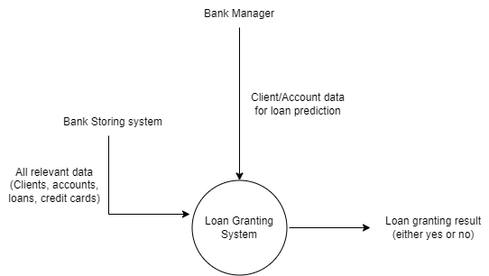

# Business Understanding

## Analysis of requirements with the end user

Banks are financial institutions, licensed to accept checking, saving deposits, and making loans. Regarding loans, it is the bank’s responsibility to accept or deny loan requests, based on the evaluation of the request. This is a decision of paramount importance that highly impacts the bank’s balance if wrongly taken. Successful loans will profit the bank, retrieving the applied fees. However, if unsuccessful, the bank might be at a loss of thousands of euros.

Given that the bank stores accurate data about their clients and previous records (transactions, granted loans, etc.), our product aims to help bank managers decide which loan requests should be accepted or not.

*Fig 1. Data Flow Diagram*

## Definition of business goals

- reduzir o crédito mal parado

- What is our product for - provide the bank some knowledge and assurance about possible future loans
- This is done by implementing a model such that it is able to previously recognize loans that will not succeed
- End goal is to assure the bank has profit with loans and won't loose money - its all about da money
- In case of error, assure the model will not allow the bank to unsuccessfully grant a loan but prevent it from granting a successful loan (overall profit for the bank)

- Business goals help measure progress
- Business goals establish accountability
- Business goals improve decision-making

SMART acronym:
- Specific. The business goal should be identified.
- Measureable. There should be some metric -- such as a percentage -- to measure progress.
- Achievable. There should be some expectation that the goal is achievable, even if it is a difficult task.
- Realistic. A goal should be realistic to the company's operations and align with its business plan.
- Time-bound. The goal should be achieved in a certain amount of time.

Other note is that a BG should align to some or more Data mining goals

## Translation of business goals into data mining goals

- mais falsos positivos ou falsos negativos, qual o goal?
- obter melhor accuracy com menor numero de falsos positivos

From a data mining perspective, our goal resides in predicting a target, the status of a loan, with the knowledge of other tables and features. 